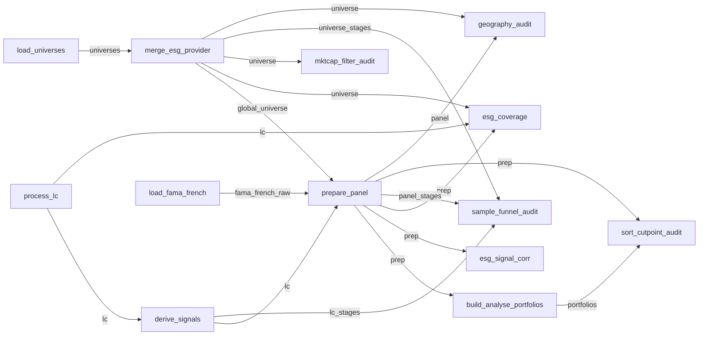

# `New_Pipeline/` — the auditable fund-analysis pipeline

A modular, auditable re-implementation of [`Main.ipynb`](../Main.ipynb), built on the
[`leonardo_nodes`](../../leonardo-nodes/README.md) framework.

Three things to know up front:

1. **The numerics did not move.** Every calculation still runs the existing pandas code in
   [functions/](../functions/), called unchanged inside each node. The pipeline is a
   wrapper that validates, hashes and records — not a rewrite.
2. **Bit-parity with the notebook is the acceptance test.** Each node names the notebook
   cells it reproduces, and [tests/test_parity.py](../tests/test_parity.py) fails if any
   output cell diverges.
3. **Every run leaves an immutable record.** A run writes a manifest saying which Process
   ran each node, the content-hash of every input and output, timings, and audit stats —
   so "why does this number look like this?" is answerable months later.

> `leonardo_nodes` is an instrumentation wrapper, **not** an execution engine. It never
> schedules anything; `run_experiment` walks the DAG this folder declares.

---

## Quickstart

```bash
# 1. install (the framework is a sibling checkout, not on PyPI)
pip install -e ../leonardo-nodes
pip install -r requirements.txt

# 2. point at the Golden LC dataset (default: ~/Documents/GitHub/data/Golden_Data)
export GOLDEN_LOCATION=/path/to/Golden_Data

# 3. structure-only check — no data touched, takes seconds
python -m New_Pipeline.registry

# 4. run a config, then look at what it produced
python -m New_Pipeline.run base_none
python -m parity.show base_none

# 5. the test suite
.venv/bin/python -m pytest tests/ -v
```

`python -m New_Pipeline.registry` prints `validate.ok`, the topological order and the external
input ports. Run it after any change to the DAG — it catches wiring mistakes without
loading a single row of data.

---

## Running experiments

An **Experiment** = this pipeline + one config + a choice of Process per node. Six are
registered in [experiments.py](experiments.py):

| Config | What it changes |
|---|---|
| `base_none` | Baseline: `esg_choice="none"`, LC signals only, both diagnostics off |
| `esg_refinitiv` | Merges the Refinitiv ESG score as an extra sorting signal (`end_year` forced to 2024) |
| `esg_msci` | Same with MSCI (`end_year` 2024) |
| `esg_snp` | Same with S&P; also sorts the ESG low leg (`end_year` forced to **2022**) |
| `esg_full_universe` | Drops LC signals entirely and sorts the full ESG universe — swaps `prepare_panel` to the `prepare_esg_universe@v1` Process |
| `show_corr` | Refinitiv + both ESG diagnostic nodes switched on |

```bash
# one config
python -m New_Pipeline.run base_none

# the whole matrix (~1 min each — every run reloads the LC panel and the universe)
for c in base_none esg_refinitiv esg_msci esg_snp esg_full_universe show_corr; do
    python -m New_Pipeline.run "$c"
done

# mirror the "latest" snapshot somewhere other than parity/artifacts/new/<config>/
python -m New_Pipeline.run base_none --out /tmp/my_run
```

Then inspect: `python -m parity.show <config>` (headline tables + a match flag),
`--all` for every artifact, `--old` to print the notebook's table too.

---

## The dashboard (cross-run audit)

```bash
python -m New_Pipeline.dashboard base_none                   # runs it, serves on :8080
python -m New_Pipeline.dashboard base_none esg_refinitiv     # two configs side by side
python -m New_Pipeline.dashboard base_none --port 5000
python -m New_Pipeline.dashboard base_none --markdown        # text only, no Taipy needed
```

What you get: the pipeline graph at the top, then one section per node in topological
order — the node's Contract intent, followed by one widget per VizSpec that Contract
declared. Every node here declares `RowCountViz`, so you get row counts as bars **coloured
by config**, which is how you spot "the ESG variant lost 40% of the universe" at a glance.

`Dashboard.run()` needs the optional Taipy dependency (`pip install taipy`, not currently
in the `.venv`); it raises a clear error if missing. `--markdown` avoids it entirely.
Annotations you type in the UI append to `./.leonardo_nodes_annotations/annotations.jsonl`
(worth gitignoring).

Why [dashboard.py](dashboard.py) *runs* the configs rather than reading archived
manifests: `Manifest` has `save()` but no `load()`, so the dashboard can only be fed
manifests created in the current process. The driver reuses `New_Pipeline.run.run()`, so those
runs are still archived to `runs/` exactly as normal.

Two lighter-weight comparisons that need no Taipy:

```python
from leonardo_nodes import ExperimentDiff, Report

Report.compare(manifests={"a": m1, "b": m2}, node="build_analyse_portfolios").to_markdown()
ExperimentDiff(exp_a, exp_b)            # what differs between two Experiment specs
m1.verify(store)                        # re-check the archive against recorded hashes
```

---

## The five concepts

> **Pipeline = structure. Experiment = structure + process choices + inputs + config.**

| Concept | Where it lives here | What it is |
|---|---|---|
| **Contract** | top of each `nodes/NN_*.py` | *What this node must do* — a prose `intent`, input/output schemas, and the `audits` (VizSpecs) it surfaces. Deliberately not a recipe: it constrains the result, not the algorithm. |
| **Process** | `@process(tag="…@v1")` function in the same file | *One implementation.* Registered content-addressed into `.leonardo_nodes_store/`, so you can delete a Process from the working tree and still reconstruct any past run. |
| **Node** | `NODE = Node(...)` at the bottom | Names + ports only. **A node never references its neighbours.** |
| **Pipeline** | [registry.py](registry.py) | Owns every edge. All topology is in the `EDGES` list — one place to read the graph. |
| **Experiment** | [experiments.py](experiments.py) | Pipeline + the `cfg` frame + `process_selection` (which Process runs at each node). |

Framework spec: [`00_glossary.md`](../../leonardo-nodes/docs/00_glossary.md),
[`02_contract.md`](../../leonardo-nodes/docs/02_contract.md),
[`05_experiment.md`](../../leonardo-nodes/docs/05_experiment.md),
[`08_dashboard.md`](../../leonardo-nodes/docs/08_dashboard.md),
[`10_reproducibility.md`](../../leonardo-nodes/docs/10_reproducibility.md).

---

## The DAG



Not drawn: every one of the 13 nodes also has an unconnected **`cfg`** port. Those are
external inputs, bound per Experiment to the same one-row config frame (see below).

The `NN_` filename prefixes are a *reading* order — and only that: `_NODE_ORDER` in
[registry.py](registry.py) is globbed off disk, so renaming or renumbering a file can never
desync the list from the directory. The real execution order comes from
`pipeline.topological_order()`:

```
process_lc → load_universes → load_fama_french → derive_signals → merge_esg_provider →
prepare_panel → mktcap_filter_audit → build_analyse_portfolios → esg_signal_corr →
esg_coverage → geography_audit → sample_funnel_audit → sort_cutpoint_audit
```

The dashboard does *not* use that order verbatim: `dashboard_viz.OrderedDashboard` defers the
audit-only sections to the bottom of the page, which no edge arrangement could achieve (they
are ready as soon as their one upstream node is).

---

## The nodes

| # | Node | Inputs → output | Notebook cells | Produces |
|---|---|---|---|---|
| 01 | [process_lc](nodes/01_process_lc.py) | `cfg` → `out` | 4, 14, 15 | The cleaned LC firm-fiscal-year table: sample filters (min-fyears / suspicious gvkeys / min-initiatives), industry mapping, industry and region drops. The signal columns are **not** computed here — that is node 02. Also snapshots the RAW Golden file, for the before/after audits and for `esg_coverage` |
| 02 | [derive_signals](nodes/02_derive_signals.py) | `lc`, `cfg` → `out` | 16, 18, 21 | The behavioural-signal panel: `sum_with_i` category aggregation, the `sum_activities` denominator, the winsor alpha-trim, then `signal_i` per `signal_type` (`weights` / `counts` / `per_revenue`), plus the optional materiality split floor |
| 03 | [load_universes](nodes/03_load_universes.py) | `cfg` → `out` | 26 (ingestion part) | The three regionally-processed Compustat universes (USA / RoW / Japan) plus `fx_rates` — currency conversion, Japan fiscal-year alignment, and the `security_status` survivorship sample. No ESG column yet |
| 04 | [merge_esg_provider](nodes/04_merge_esg_provider.py) | `universes`, `cfg` → `out` | 26 (ESG-merge part) | The assembled monthly `global_universe` — returns, market cap, currency, mkt-cap screen — carrying exactly one provider's ESG column. **Four Processes** — see below |
| 05 | [load_fama_french](nodes/05_load_fama_french.py) | `cfg` → `out` | 26 (factor part) | FF3 (`mktrf`, `smb`, `hml`, `rf`) **and** FF5 (+ `rmw`, `cma`), each read from its own file, JPY-converted when configured, with a `mom` column joined onto both when `Add_Momentum_Factor` is set |
| 06 | [prepare_panel](nodes/06_prepare_panel.py) | `global_universe`, `lc`, `fama_french_raw`, `cfg` → `out` | 29 | The monthly sorting panel: returns aligned to the universe, cross-signal NaN mask, z-scored signals, aligned factors — plus the final-sample descriptives, since this is the last stage at which the analysis sample changes. **Two Processes** — see below |
| 07 | [build_analyse_portfolios](nodes/07_build_analyse_portfolios.py) | `prep`, `cfg` → `out` | 31, 34, 36–39, 42, 43, 48, 51, 58, 59 | Every portfolio-level analytic in one bundle: quantile portfolios `p_1..p_K`, excess returns, the Market row and per-signal High−Low spreads; the level FF3 **and** FF5 tables plus rolling alphas at both windows (40, 24); the cumulative-return and risk tables; constituent counts and holdings over time. Folds the former `build_portfolios`, `ff3_alphas`, `performance_tables` and `build_constituents` into one stage |
| 08 | [esg_signal_corr](nodes/08_esg_signal_corr.py) | `prep`, `cfg` → `out` | 52 | **Gated diagnostic**: ESG-on-signal regressions + correlation matrices, at standardised and non-standardised scales |
| 09 | [esg_coverage](nodes/09_esg_coverage.py) | `universe`, `lc`, `prep`, `cfg` → `out` | 63 | **Gated diagnostic**: % of firm-years with a non-NaN ESG score per provider per sample, plus firms-with-ESG per fiscal year |
| 10 | [mktcap_filter_audit](nodes/10_mktcap_filter_audit.py) | `universe`, `cfg` → `out` | — (audit-only) | Replays the market-cap screen that runs inside `process_global_universe`: listings in and removed per month, the share, the effective per-listing size floor, and a per-currency-area breakdown of the same pooled cell |
| 11 | [sample_funnel_audit](nodes/11_sample_funnel_audit.py) | `lc_stages`, `universe_stages`, `panel_stages`, `cfg` → `out` | — (audit-only) | The sample funnel in true execution order — distinct firms still standing after every stage that can drop one. Owns no measurement: each row is counted by the node where that filter runs and forwarded here |
| 12 | [sort_cutpoint_audit](nodes/12_sort_cutpoint_audit.py) | `prep`, `portfolios`, `cfg` → `out` | — (audit-only) | The tie mass sitting exactly on each quantile cutpoint, and whether it explains the mirror-portfolio gap. Takes `portfolios` as well as `prep` so the replayed sort can be cross-checked against the real buckets |
| 13 | [geography_audit](nodes/13_geography_audit.py) | `universe`, `panel`, `cfg` → `out` | — (audit-only) | Country and listing-currency composition of the three universes, pre- and post-screen, with the final sample's composition (forwarded verbatim from `prepare_panel`) beside it |

Nodes 10–13 are **audit-only**: nothing downstream reads them and `parity.compare` does not
diff their artifacts.

**Two nodes carry interchangeable Processes**, and they are the clearest example of what
Contracts buy you — one contract, several implementations, the Experiment picks:

- `prepare_panel` — `prepare_lc@v1` (LC-merged signals; every config except one) or
  `prepare_esg_universe@v1` (full ESG universe, the ESG score as the sole signal —
  `esg_full_universe`)
- `merge_esg_provider` — `esg_none@v1` / `esg_refinitiv@v1` / `esg_msci@v1` / `esg_snp@v1`,
  one per ESG choice rather than an `if/elif` inside a single Process

**Gated diagnostics** (08, 09) return `boundary.empty_sentinel()` when their `cfg` switch
(`show_esg_corr_matricies` / `show_esg_coverage`) is off. The node still runs and still
records — the structure of the pipeline never changes with config. Detect with
`SENTINEL_COL in df.columns`.

The audit nodes gate the same way — `show_mktcap_filter_audit` / `show_sample_funnel_audit` /
`show_sort_cutpoint_audit`, all defaulting to `True` — but return an **empty bundle** rather
than a sentinel, so `unpack_obj` still works on the far side. `geography_audit` is ungated.

---

## Config is data (the thing that surprises people first)

A Process receives **only its declared input frames** — never `exp.config`. So config
cannot arrive as a Python kwarg; it has to travel as a frame.

[experiments.py](experiments.py) does that in two steps:

1. `build_cfg(**overrides)` derives the *whole* config exactly as the notebook does —
   cell 2 (scalar knobs, the `region_analysis` if/elif block, the `esg_choice` end-year
   override), cell 8 (signal design → `categories_dict` + `lc_signals`), cell 11
   (`hml_directions`, `universe_signals`, `analysis_selection`). Order matters and is
   preserved deliberately.
2. `cfg_frame(cfg)` packs it into a one-row frame — `{"json": [json.dumps(cfg)]}` — which
   `make_experiment` binds to **every** `*.cfg` port.

So every node starts the same way:

```python
C = json.loads(cfg["json"][0])
```

Because the cfg frame is hashed like any other input, two runs with the same config share
the same `cfg` hash in their manifests — and a config change is visible as a hash change.

---

## The pandas ↔ polars boundary

`leonardo_nodes` hashes and validates `pl.DataFrame` at node boundaries; all this
project's numerics are pandas. [boundary.py](boundary.py) is the **only** place containers
convert, and the conversions are lossless, order-preserving identities (they bridge
through Arrow: `float64`↔`double`, `datetime64[ns]`↔`timestamp[ns]`, same bits).

| Use | Helper | For |
|---|---|---|
| Tidy analytical table | `pd_to_pl` / `pl_to_pd` | Real column schemas, real audit value — the FF3 / cumulative / risk tables |
| Dict of wide pivots | `wide_to_long_blocks` / `long_blocks_to_wide` | Heterogeneous pivots sharing one output frame via a `block` discriminator |
| Wide, mixed-dtype plumbing bundle | `pack_obj` / `unpack_obj` | The LC table, the universe, the `prep`/`port` bundles — pickled so dtype coercion can't break parity |
| Gated node, nothing to emit | `empty_sentinel` | Keeps `process_selection` complete while signalling "off" |

Must **not** cross a boundary — handle inside the Process: fitted statsmodels models,
pandas `MultiIndex` (flatten first).

```bash
python -m New_Pipeline.boundary     # self-test: proves each round trip is an identity
```

---

## Outputs and provenance

Every `python -m New_Pipeline.run <config>` writes to **two** places
([run.py](run.py)):

```
runs/<UTC-timestamp>_<config>/      NEW folder per run, never overwritten
    ff3_parts_df.parquet, ff5_parts_df.parquet,   both alpha specifications, side by side
    table_returns.parquet, table_excess.parquet,  the regression inputs
    manifest.json                   structured, for machines
    manifest.md                     narrative, for humans
    dashboard.md                    frozen text snapshot of this run's audit dashboard
    debug_prints.log                every print() the nodes + functions/ emitted this run
                                     (captured, not streamed to the console — written even
                                     if the run raises partway through)
    initiative_decomposition.pdf/.csv   only when the config asks for them

parity/artifacts/new/<config>/      "latest" snapshot, OVERWRITTEN each run
                                    (this is what parity.compare / parity.show read)
```

The diagnostic and audit nodes (08–13) write no parquet of their own: their frames reach you
through `manifest.json`'s audit payloads and `dashboard.md`, straight from the nodes that
produced them. `runs/`, `parity/artifacts/` and `.leonardo_nodes_store/` are all gitignored —
generated, not source.

**One node, every artifact.** `build_analyse_portfolios` is the single source of all four
exported parquets: `_export` in [run.py](run.py) unpacks its bundle and writes the keys named
in `_MERGED_EXPORTS` — `ff3_parts_df` / `ff5_parts_df` (indexed on `metric`) and
`table_returns` / `table_excess` (indexed on `date`). Folding the four former portfolio stages
into one node left the on-disk artifacts — and therefore the parity check — completely
unchanged, because the bundle keys kept the old file names.

That export list is deliberately short. `cumulative_table`, `risk_table`, `constituents_*` and
`holdings_over_time` are still built, bundled and audited; they are simply no longer spilled to
disk, since `dashboard.md` and `manifest.json` already carry everything they summarise. Trimming
`_MERGED_EXPORTS` stops files being written — it never stops a node running.

**Bundles and the row-count problem.** A `pack_obj` bundle is a single pickle cell, so a plain
`RowCountViz` over it would always report `1`. Nodes that emit bundles declare **custom
statistics** instead, so the manifest and dashboard still show real numbers:

```
### Node `build_analyse_portfolios` — OK
- audits: `{'bars:ff3_rows': …, 'bars:ff5_rows': …, 'bars:rolling_rows': …}`
```

That's the general escape hatch for any node whose output is a bundle: pass
`custom={"<token>": callable}` to a VizSpec (see the module-level helpers above the Contract in
[nodes/07_build_analyse_portfolios.py](nodes/07_build_analyse_portfolios.py)). The callable runs
in the live process and is not archived, so keep it a thin measurement — it is not part of
`contract_version`.

The level FF3 and FF5 tables are exported to `ff3_parts_df.parquet` / `ff5_parts_df.parquet`.
The rolling alphas are **not tabulated to disk** — they are a plot: the 24-month window is
surfaced for each specification by a `BundleMultiSeriesViz` audit drawing one line per
portfolio, while the 40-month window is computed and bundled but not rendered.

```bash
python -m New_Pipeline.dashboard base_none            # rolling-alpha charts under build_analyse_portfolios
python -m New_Pipeline.dashboard base_none esg_snp    # same charts, one subplot per config
```

`BundleMultiSeriesViz` (in [dashboard_viz.py](dashboard_viz.py)) sets
`options["multi_series"]`, which is what makes `Dashboard._lines_figure` draw one subplot per
config with all portfolio lines overlaid and a stable colour per portfolio across subplots.

The manifest is the point of the whole exercise. An excerpt:

```
### Node `prepare_panel` — OK
- process: `bf2b55591365`  contract: `459a7482b95d`
- inputs: global_universe=`2076d8ee85a8`, lc=`5d3d442b360f`, fama_french_raw=`4cd8ef16159d`, cfg=`5cfd7bcde936`
- output: `d6ace747af6a`  (5.708s)
- audits: `{'bars:row_count': 1}`
```

Which implementation ran, against which contract version, on exactly which inputs,
producing exactly which output, how long it took. `process: bf2b55591365` resolves in
`.leonardo_nodes_store/` to the archived source, even if that Process has since been
deleted from the working tree.

---

## Verifying it still matches the notebook

```bash
python -m parity.compare               # every config found under parity/artifacts/new/
python -m parity.compare base_none     # one config; non-zero exit on any failure
python -m parity.show base_none        # print notebook + pipeline tables side by side
```

[parity/compare.py](../parity/compare.py) aligns columns, sorts rows by a stable key, then:
string/object cells must be **exactly** equal (formatted %-tables, gvkeys, dates); numeric
cells must satisfy `np.isclose(rtol=1e-9, atol=1e-12, equal_nan=True)`.

[tests/test_parity.py](../tests/test_parity.py) has three layers:

1. `test_boundary_roundtrip` — fast, no data: the boundary conversions are identities.
2. `test_pipeline_validates_and_registers` — the DAG validates and all processes register
   (13 nodes and 17 processes here, since `merge_esg_provider` has 4 and `prepare_panel` 2).
   Note that this test, and `test_boundary_roundtrip` above it, still import the `pipeline`
   package, which has since been deleted from the tree — as written they error rather than
   exercising this one.
3. `test_parity[<config>]` — per-config output equality against the frozen notebook
   oracle in `parity/artifacts/old/`. **Skipped** if artifacts are absent, so a green
   suite on a fresh checkout does not mean parity was checked — run the configs first.

---

## How to extend it

### Add a Process to an existing node (the common case)

Add a second `@process` in the same node file with a new tag, then select it:

```python
@process(tag="build_analyse_portfolios@v2", contract="build_analyse_portfolios", author="you")
def build_analyse_portfolios_v2(prep, cfg):
    import json                      # imports go INSIDE the function
    ...
```

Point an Experiment at it via `process_selection` (see `make_experiment`, which already
does this for `prepare_panel` through its `prepare_tag` argument). The old Process stays
archived and every past run remains reproducible — **you never have to delete or preserve
an old implementation to try a new one.**

One hard constraint: **a Process body must be self-contained.** Imports inside the
function, no module-level helpers or globals — archived Processes are re-executed in a
fresh namespace. `prepare_lc_v1` inlines its return bundle for exactly this reason.

### Add a node

1. Create `nodes/NN_<name>.py` with `CONTRACT` / `@process` / `NODE`, in that order
   (copy the shape of [03_load_universes.py](nodes/03_load_universes.py) — the smallest node
   that isn't a gated diagnostic).
2. Nothing to register: `_NODE_ORDER` in [registry.py](registry.py) globs `nodes/NN_*.py` off
   disk, so the file is picked up by its name alone.
3. Add its wires to `EDGES` in the same file. **Never** import one node from another.
4. `python -m New_Pipeline.registry` — validate before you run anything.
5. Bump the process count assertion in [tests/test_parity.py](../tests/test_parity.py).

### Add a config

Add a `build_cfg(...)` override function plus an `EXPERIMENTS` entry in
[experiments.py](experiments.py), and add the name to `CONFIGS` in
[tests/test_parity.py](../tests/test_parity.py). It is immediately runnable with
`python -m New_Pipeline.run <name>` and appears in the dashboard with no other changes.

### Add an audit widget

Append a `VizSpec` to that node's `CONTRACT.audits`. It shows up in the dashboard and in
every future `manifest.md` — no driver changes. See
[`07_vizspec.md`](../../leonardo-nodes/docs/07_vizspec.md).

### Tighten a schema

`_common.open_schema()` is deliberately permissive (`allow_extra=True`) so validation
never blocked the parity-first build. Once a node's output is stable, replace it with a
real `ColumnSchema(columns={...}, non_null=[...])`. This is the single highest-value
cleanup available in this folder.

### House rules

- Nodes never import each other; edges live only on the Pipeline.
- No lambdas as Processes (source must be recoverable) and no module-level globals in one.
- Numerics stay in [functions/](../functions/) — a node orchestrates, it doesn't compute.
- Config never arrives as a Python kwarg; it arrives as the `cfg` frame.
- Contract intent states *purpose + mandatory measures + what it surfaces*, never the
  algorithm — that's the Process's choice.

---

## File map

```
New_Pipeline/
  _common.py       the single shared ProcessStore + cfg_schema/open_schema helpers
  boundary.py      the ONLY pandas<->polars conversion point (+ self-test)
  registry.py      node list, EDGES, build_pipeline(), register_processes()
  experiments.py   build_cfg (notebook cells 2/8/11), cfg_frame, the 6 EXPERIMENTS
  run.py           driver: run one config, archive to runs/, snapshot for parity
  dashboard.py     driver: run config(s), open the audit dashboard
  nodes/           NN_<name>.py — one Contract + Process(es) + Node per file

../parity/         compare.py (automated parity) + show.py (human viewer)
../tests/          test_parity.py — boundary, DAG, per-config parity
../runs/           per-run archive: parquet + manifest.json/.md  (gitignored)
```

`../parity/` and `../tests/` still import the original `pipeline/` package — see
"Relationship to `pipeline/`" below.

---

## Known gaps

- **Schemas are permissive.** `open_schema()` everywhere; column/dtype validation is not
  yet doing real work. See "Tighten a schema" above.
- **MSCI benchmark series is deliberately omitted** from `build_analyse_portfolios` — it fed only
  a commented-out benchmark line in the notebook and none of the parity artifacts.
- **Factor models.** `load_fama_french` loads FF3 and FF5 unconditionally, each from its
  own `data/FAMA/*_{3,5}_Factors.csv`; neither is derived from the other. Setting
  `Add_Momentum_Factor` joins `data/FAMA/<region>_Momentum_Factor.csv` onto **both** as a
  `mom` column, making them Carhart's 4-factor and the 6-factor model — the risk table's
  headers then read `Alpha FF3 + Mom` / `Alpha FF5 + Mom` rather than gaining a second
  pair of columns. Momentum exists for `Europe` and `United_States` only; any other
  region raises. The momentum CSVs need no trimming (the loader keeps only the `YYYYMM`
  rows), unlike the 3-/5-factor files.
- **No plots.** The numeric data behind the constituent plots is produced
  (inside `build_analyse_portfolios`); rendering is not.
- **The dashboard needs Taipy**, which is not in `requirements.txt`
  (`pip install taipy`). `--markdown` works without it.

---

## Relationship to `pipeline/`

> **`pipeline/` has since been removed from the tree** — `New_Pipeline/` is now the only
> package. The rest of this section is history, kept because `tests/` and `parity/` still
> import the old package name.

`New_Pipeline/` began as a full copy of `pipeline/` — originally the same 12 nodes, same
Contracts, same Processes — with every internal import rewritten so it is a genuinely
independent package (`from New_Pipeline._common import store`, not `from pipeline…`). The
node set has since diverged: the 12 became the 13 above as nodes were split, merged and
audits added.

Three things it still *shares* with `pipeline/`, because the paths are relative to the
repo root rather than to the package:

| Shared | Effect |
|---|---|
| `.leonardo_nodes_store/` | Harmless and useful — the archive is content-addressed, so the rewritten Processes register under new IDs alongside the originals. Nothing is overwritten. |
| `runs/` | Harmless — folders are timestamped, so runs from both packages interleave without collision. The archived `manifest.md` does not record which package produced it, so use distinct config names if you need to tell them apart. |
| `parity/artifacts/new/<config>/` | **Watch this one.** `run.py` writes the "latest" snapshot to the same path for both packages, so `python -m New_Pipeline.run base_none` overwrites the snapshot that `python -m pipeline.run base_none` left. `python -m parity.compare` / `parity.show` then reads *your* output while `tests/test_parity.py` still imports `pipeline/`. Use `--out` to keep them apart: `python -m New_Pipeline.run base_none --out parity/artifacts/new_pipeline/base_none`. |

Also note: `tests/test_parity.py` imports `pipeline.registry` and `pipeline.boundary`, so a
green test suite says nothing about this copy. Point the tests at `New_Pipeline` (or add a
parallel test module) once you start diverging.
