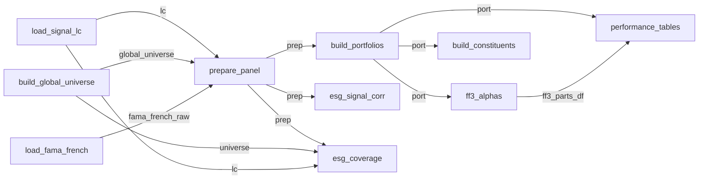

# `New_Pipeline/` — the auditable fund-analysis pipeline

A modular, auditable re-implementation of [`Main.ipynb`](../Main.ipynb), built on the
[`leonardo_nodes`](../../leonardo-nodes/README.md) framework.

Three things to know up front:

1. **The numerics did not move.** Every calculation still runs the existing pandas code in
   [functions/](../functions/), called unchanged inside each node. The pipeline is a
   wrapper that validates, hashes and records — not a rewrite.
2. **Bit-parity with the notebook is the acceptance test.** Each node names the notebook
   cells it reproduces, and [tests/test_parity.py](../tests/test_parity.py) fails if any
   output cell diverges.
3. **Every run leaves an immutable record.** A run writes a manifest saying which Process
   ran each node, the content-hash of every input and output, timings, and audit stats —
   so "why does this number look like this?" is answerable months later.

> `leonardo_nodes` is an instrumentation wrapper, **not** an execution engine. It never
> schedules anything; `run_experiment` walks the DAG this folder declares.

---

## Quickstart

```bash
# 1. install (the framework is a sibling checkout, not on PyPI)
pip install -e ../leonardo-nodes
pip install -r requirements.txt

# 2. point at the Golden LC dataset (default: ~/Documents/GitHub/data/Golden_Data)
export GOLDEN_LOCATION=/path/to/Golden_Data

# 3. structure-only check — no data touched, takes seconds
python -m New_Pipeline.registry

# 4. run a config, then look at what it produced
python -m New_Pipeline.run base_none
python -m parity.show base_none

# 5. the test suite
.venv/bin/python -m pytest tests/ -v
```

`python -m New_Pipeline.registry` prints `validate.ok`, the topological order and the external
input ports. Run it after any change to the DAG — it catches wiring mistakes without
loading a single row of data.

---

## Running experiments

An **Experiment** = this pipeline + one config + a choice of Process per node. Six are
registered in [experiments.py](experiments.py):

| Config | What it changes |
|---|---|
| `base_none` | Baseline: `esg_choice="none"`, LC signals only, both diagnostics off |
| `esg_refinitiv` | Merges the Refinitiv ESG score as an extra sorting signal (`end_year` forced to 2024) |
| `esg_msci` | Same with MSCI (`end_year` 2024) |
| `esg_snp` | Same with S&P; also sorts the ESG low leg (`end_year` forced to **2022**) |
| `esg_full_universe` | Drops LC signals entirely and sorts the full ESG universe — swaps `prepare_panel` to the `prepare_esg_universe@v1` Process |
| `show_corr` | Refinitiv + both ESG diagnostic nodes switched on |

```bash
# one config
python -m New_Pipeline.run base_none

# the whole matrix (~1 min each — every run reloads the LC panel and the universe)
for c in base_none esg_refinitiv esg_msci esg_snp esg_full_universe show_corr; do
    python -m New_Pipeline.run "$c"
done

# mirror the "latest" snapshot somewhere other than parity/artifacts/new/<config>/
python -m New_Pipeline.run base_none --out /tmp/my_run
```

Then inspect: `python -m parity.show <config>` (headline tables + a match flag),
`--all` for every artifact, `--old` to print the notebook's table too.

---

## The dashboard (cross-run audit)

```bash
python -m New_Pipeline.dashboard base_none                   # runs it, serves on :8080
python -m New_Pipeline.dashboard base_none esg_refinitiv     # two configs side by side
python -m New_Pipeline.dashboard base_none --port 5000
python -m New_Pipeline.dashboard base_none --markdown        # text only, no Taipy needed
```

What you get: the pipeline graph at the top, then one section per node in topological
order — the node's Contract intent, followed by one widget per VizSpec that Contract
declared. Every node here declares `RowCountViz`, so you get row counts as bars **coloured
by config**, which is how you spot "the ESG variant lost 40% of the universe" at a glance.

`Dashboard.run()` needs the optional Taipy dependency (`pip install taipy`, not currently
in the `.venv`); it raises a clear error if missing. `--markdown` avoids it entirely.
Annotations you type in the UI append to `./.leonardo_nodes_annotations/annotations.jsonl`
(worth gitignoring).

Why [dashboard.py](dashboard.py) *runs* the configs rather than reading archived
manifests: `Manifest` has `save()` but no `load()`, so the dashboard can only be fed
manifests created in the current process. The driver reuses `New_Pipeline.run.run()`, so those
runs are still archived to `runs/` exactly as normal.

Two lighter-weight comparisons that need no Taipy:

```python
from leonardo_nodes import ExperimentDiff, Report

Report.compare(manifests={"a": m1, "b": m2}, node="build_portfolios").to_markdown()
ExperimentDiff(exp_a, exp_b)            # what differs between two Experiment specs
m1.verify(store)                        # re-check the archive against recorded hashes
```

---

## The five concepts

> **Pipeline = structure. Experiment = structure + process choices + inputs + config.**

| Concept | Where it lives here | What it is |
|---|---|---|
| **Contract** | top of each `nodes/NN_*.py` | *What this node must do* — a prose `intent`, input/output schemas, and the `audits` (VizSpecs) it surfaces. Deliberately not a recipe: it constrains the result, not the algorithm. |
| **Process** | `@process(tag="…@v1")` function in the same file | *One implementation.* Registered content-addressed into `.leonardo_nodes_store/`, so you can delete a Process from the working tree and still reconstruct any past run. |
| **Node** | `NODE = Node(...)` at the bottom | Names + ports only. **A node never references its neighbours.** |
| **Pipeline** | [registry.py](registry.py) | Owns every edge. All topology is in the `EDGES` list — one place to read the graph. |
| **Experiment** | [experiments.py](experiments.py) | Pipeline + the `cfg` frame + `process_selection` (which Process runs at each node). |

Framework spec: [`00_glossary.md`](../../leonardo-nodes/docs/00_glossary.md),
[`02_contract.md`](../../leonardo-nodes/docs/02_contract.md),
[`05_experiment.md`](../../leonardo-nodes/docs/05_experiment.md),
[`08_dashboard.md`](../../leonardo-nodes/docs/08_dashboard.md),
[`10_reproducibility.md`](../../leonardo-nodes/docs/10_reproducibility.md).

---

## The DAG



Not drawn: every one of the 10 nodes also has an unconnected **`cfg`** port. Those are
external inputs, bound per Experiment to the same one-row config frame (see below).

The `NN_` filename prefixes are a *reading* order. The real execution order comes from
`pipeline.topological_order()`:

```
load_signal_lc → build_global_universe → load_fama_french → prepare_panel →
build_portfolios → esg_signal_corr → esg_coverage → build_constituents →
ff3_alphas → performance_tables
```

---

## The nodes

| # | Node | Inputs → output | Notebook cells | Produces |
|---|---|---|---|---|
| 01 | [load_signal_lc](nodes/01_load_signal_lc.py) | `cfg` → `out` | 4, 14, 15, 16, 18, 21 | The cleaned LC firm-fiscal-year table with `signal_i = sum_with_i / sum_activities`: sample filters, industry mapping, winsor alpha-trim |
| 02 | [build_global_universe](nodes/02_build_global_universe.py) | `cfg` → `out` | 26 (universe part) | Monthly tradable universe — returns, market cap, currency, FX conversion, ESG provider merge |
| 03 | [load_fama_french](nodes/03_load_fama_french.py) | `cfg` → `out` | 26 (factor part) | FF3 factors (`mktrf`, `smb`, `hml`, `rf`) for the configured region, with JPY conversion when configured |
| 04 | [prepare_panel](nodes/04_prepare_panel.py) | `global_universe`, `lc`, `fama_french_raw`, `cfg` → `out` | 29 | The monthly sorting panel: returns aligned to universe, cross-signal NaN mask, z-scored signals, aligned factors. **Two Processes** — see below |
| 05 | [build_portfolios](nodes/05_build_portfolios.py) | `prep`, `cfg` → `out` | 31, 34, 36–39, 42, 43, 51 | Quantile portfolios `p_1..p_K` per signal, excess returns, Market row, High−Low spreads, and the include-all table inputs |
| 06 | [ff3_alphas](nodes/06_ff3_alphas.py) | `port`, `cfg` → `out` | 48, 43 | **Both** FF3 alpha views in one bundle: the level table (`ff3_parts_df` — alpha/betas/p-values/Adj. R², 2dp) and the rolling alphas at the 40- and 24-month windows, long by `(date, label, window)`. Exported as two parquets |
| 07 | [performance_tables](nodes/07_performance_tables.py) | `port`, `ff3_parts_df`, `cfg` → `out` | 51 | **Both** per-portfolio tables in one tidy frame: horizon compound returns (1m…Since launch) and Sharpe / VaR 1% / Max Drawdown + Alpha/p-value from `ff3_parts_df`. Split back into two parquets on export — see below |
| 08 | [build_constituents](nodes/08_build_constituents.py) | `port`, `cfg` → `out` | 58, 59 (numeric parts) | Constituent counts by Industry and by `loc` over time, plus high-bucket holdings — the data behind the constituent plots |
| 09 | [esg_signal_corr](nodes/09_esg_signal_corr.py) | `prep`, `cfg` → `out` | 52 | **Gated diagnostic**: ESG-on-signal regressions + correlation matrices |
| 10 | [esg_coverage](nodes/10_esg_coverage.py) | `universe`, `lc`, `prep`, `cfg` → `out` | 63 | **Gated diagnostic**: % of firm-years with a non-NaN ESG score per provider per sample |

**`prepare_panel` is the one node with two interchangeable Processes**, and it is the
clearest example of what Contracts buy you — same contract, two implementations, the
Experiment picks:

- `prepare_lc@v1` — LC-merged signals (used by every config except one)
- `prepare_esg_universe@v1` — full ESG universe, ESG score as the sole signal
  (`esg_full_universe`)

**Gated diagnostics** (11, 12) return `boundary.empty_sentinel()` when their `cfg` switch
(`show_esg_corr_matricies` / `show_esg_coverage`) is off. The node still runs and still
records — the structure of the pipeline never changes with config. Detect with
`SENTINEL_COL in df.columns`.

---

## Config is data (the thing that surprises people first)

A Process receives **only its declared input frames** — never `exp.config`. So config
cannot arrive as a Python kwarg; it has to travel as a frame.

[experiments.py](experiments.py) does that in two steps:

1. `build_cfg(**overrides)` derives the *whole* config exactly as the notebook does —
   cell 2 (scalar knobs, the `region_analysis` if/elif block, the `esg_choice` end-year
   override), cell 8 (signal design → `categories_dict` + `lc_signals`), cell 11
   (`hml_directions`, `universe_signals`, `analysis_selection`). Order matters and is
   preserved deliberately.
2. `cfg_frame(cfg)` packs it into a one-row frame — `{"json": [json.dumps(cfg)]}` — which
   `make_experiment` binds to **every** `*.cfg` port.

So every node starts the same way:

```python
C = json.loads(cfg["json"][0])
```

Because the cfg frame is hashed like any other input, two runs with the same config share
the same `cfg` hash in their manifests — and a config change is visible as a hash change.

---

## The pandas ↔ polars boundary

`leonardo_nodes` hashes and validates `pl.DataFrame` at node boundaries; all this
project's numerics are pandas. [boundary.py](boundary.py) is the **only** place containers
convert, and the conversions are lossless, order-preserving identities (they bridge
through Arrow: `float64`↔`double`, `datetime64[ns]`↔`timestamp[ns]`, same bits).

| Use | Helper | For |
|---|---|---|
| Tidy analytical table | `pd_to_pl` / `pl_to_pd` | Real column schemas, real audit value — the FF3 / cumulative / risk tables |
| Dict of wide pivots | `wide_to_long_blocks` / `long_blocks_to_wide` | Heterogeneous pivots sharing one output frame via a `block` discriminator |
| Wide, mixed-dtype plumbing bundle | `pack_obj` / `unpack_obj` | The LC table, the universe, the `prep`/`port` bundles — pickled so dtype coercion can't break parity |
| Gated node, nothing to emit | `empty_sentinel` | Keeps `process_selection` complete while signalling "off" |

Must **not** cross a boundary — handle inside the Process: fitted statsmodels models,
pandas `MultiIndex` (flatten first).

```bash
python -m New_Pipeline.boundary     # self-test: proves each round trip is an identity
```

---

## Outputs and provenance

Every `python -m New_Pipeline.run <config>` writes to **two** places
([run.py](run.py)):

```
runs/<UTC-timestamp>_<config>/      NEW folder per run, never overwritten
    risk_table.parquet, cumulative_table.parquet, ff3_parts_df.parquet,
    rolling_alphas.parquet, constituents_Industry.parquet, constituents_loc.parquet,
    holdings_over_time.parquet
    manifest.json                   structured, for machines
    manifest.md                     narrative, for humans

parity/artifacts/new/<config>/      "latest" snapshot, OVERWRITTEN each run
                                    (this is what parity.compare / parity.show read)
```

Plus the ESG diagnostic frames when those nodes are enabled. `runs/`,
`parity/artifacts/` and `.leonardo_nodes_store/` are all gitignored — generated, not
source.

**One node, two artifacts.** `performance_tables` emits a single tidy frame whose columns
are prefixed `cumulative_table::…` and `risk_table::…`; `_export` splits on `::` and writes
the two parquets under their original names, preserving row and column order. That's why the
merge of the former nodes 08 and 09 left the on-disk artifacts — and therefore the parity
check — completely unchanged. `_SPLIT_SEP` in [run.py](run.py) and the `sep` literal in
[nodes/07_performance_tables.py](nodes/07_performance_tables.py) are the two halves of that
contract; keep them in sync.

Carrying both tables in one *tidy* frame rather than a `pack_obj` bundle is deliberate: it
keeps `RowCountViz` honest (`row_count: 10` for `base_none`, 13 for the ESG configs, 4 for
`esg_full_universe`) instead of reporting `1` for a pickle cell.

**`ff3_alphas` does the same for two frames that share no key.** The level FF3 table (9 rows
× portfolios) and the rolling alphas (~1000 rows, long) can't be joined, so they travel as a
pickle bundle — which would normally make the audit report `1`. Instead the Contract declares
two **custom statistics**, so the manifest and dashboard still show both:

```
### Node `ff3_alphas` — OK
- audits: `{'bars:ff3_rows': 9, 'bars:rolling_rows': 994}`
```

That's the general escape hatch for any node whose output is a bundle: pass
`custom={"<token>": callable}` to a VizSpec (see the two module-level helpers in
[nodes/06_ff3_alphas.py](nodes/06_ff3_alphas.py)). The callable runs in the live process and
is not archived, so keep it a thin measurement — it is not part of `contract_version`.

Both frames are exported, so alpha and its rolling history can be read side by side:

```python
ff3  = pd.read_parquet("…/ff3_parts_df.parquet").set_index("metric")
roll = pd.read_parquet("…/rolling_alphas.parquet")   # date, alpha, label, window
ff3.loc["alpha"]                                     # level alpha per portfolio
roll[roll["label"] == "High transformation"]         # its rolling history
```

Note `rolling_alphas.parquet` is newly exported and has **no frozen notebook oracle**, so
`parity.compare` reports it as present only on the new side. It is verified run-to-run, not
against `Main.ipynb`.

The manifest is the point of the whole exercise. An excerpt:

```
### Node `prepare_panel` — OK
- process: `bf2b55591365`  contract: `459a7482b95d`
- inputs: global_universe=`2076d8ee85a8`, lc=`5d3d442b360f`, fama_french_raw=`4cd8ef16159d`, cfg=`5cfd7bcde936`
- output: `d6ace747af6a`  (5.708s)
- audits: `{'bars:row_count': 1}`
```

Which implementation ran, against which contract version, on exactly which inputs,
producing exactly which output, how long it took. `process: bf2b55591365` resolves in
`.leonardo_nodes_store/` to the archived source, even if that Process has since been
deleted from the working tree.

---

## Verifying it still matches the notebook

```bash
python -m parity.compare               # every config found under parity/artifacts/new/
python -m parity.compare base_none     # one config; non-zero exit on any failure
python -m parity.show base_none        # print notebook + pipeline tables side by side
```

[parity/compare.py](../parity/compare.py) aligns columns, sorts rows by a stable key, then:
string/object cells must be **exactly** equal (formatted %-tables, gvkeys, dates); numeric
cells must satisfy `np.isclose(rtol=1e-9, atol=1e-12, equal_nan=True)`.

[tests/test_parity.py](../tests/test_parity.py) has three layers:

1. `test_boundary_roundtrip` — fast, no data: the boundary conversions are identities.
2. `test_pipeline_validates_and_registers` — the DAG validates and all processes register
   (10 nodes and 11 processes here, since `prepare_panel` has 2; note this test currently
   imports `pipeline`, which still has 12 nodes / 13 processes).
3. `test_parity[<config>]` — per-config output equality against the frozen notebook
   oracle in `parity/artifacts/old/`. **Skipped** if artifacts are absent, so a green
   suite on a fresh checkout does not mean parity was checked — run the configs first.

---

## How to extend it

### Add a Process to an existing node (the common case)

Add a second `@process` in the same node file with a new tag, then select it:

```python
@process(tag="build_portfolios@v2", contract="build_portfolios", author="you")
def build_portfolios_v2(prep, cfg):
    import json                      # imports go INSIDE the function
    ...
```

Point an Experiment at it via `process_selection` (see `make_experiment`, which already
does this for `prepare_panel` through its `prepare_tag` argument). The old Process stays
archived and every past run remains reproducible — **you never have to delete or preserve
an old implementation to try a new one.**

One hard constraint: **a Process body must be self-contained.** Imports inside the
function, no module-level helpers or globals — archived Processes are re-executed in a
fresh namespace. `prepare_lc_v1` inlines its return bundle for exactly this reason.

### Add a node

1. Create `nodes/NN_<name>.py` with `CONTRACT` / `@process` / `NODE`, in that order
   (copy the shape of [03_load_fama_french.py](nodes/03_load_fama_french.py) — it's the smallest).
2. Add the module name to `_NODE_ORDER` in [registry.py](registry.py).
3. Add its wires to `EDGES` in the same file. **Never** import one node from another.
4. `python -m New_Pipeline.registry` — validate before you run anything.
5. Bump the process count assertion in [tests/test_parity.py](../tests/test_parity.py).

### Add a config

Add a `build_cfg(...)` override function plus an `EXPERIMENTS` entry in
[experiments.py](experiments.py), and add the name to `CONFIGS` in
[tests/test_parity.py](../tests/test_parity.py). It is immediately runnable with
`python -m New_Pipeline.run <name>` and appears in the dashboard with no other changes.

### Add an audit widget

Append a `VizSpec` to that node's `CONTRACT.audits`. It shows up in the dashboard and in
every future `manifest.md` — no driver changes. See
[`07_vizspec.md`](../../leonardo-nodes/docs/07_vizspec.md).

### Tighten a schema

`_common.open_schema()` is deliberately permissive (`allow_extra=True`) so validation
never blocked the parity-first build. Once a node's output is stable, replace it with a
real `ColumnSchema(columns={...}, non_null=[...])`. This is the single highest-value
cleanup available in this folder.

### House rules

- Nodes never import each other; edges live only on the Pipeline.
- No lambdas as Processes (source must be recoverable) and no module-level globals in one.
- Numerics stay in [functions/](../functions/) — a node orchestrates, it doesn't compute.
- Config never arrives as a Python kwarg; it arrives as the `cfg` frame.
- Contract intent states *purpose + mandatory measures + what it surfaces*, never the
  algorithm — that's the Process's choice.

---

## File map

```
New_Pipeline/
  _common.py       the single shared ProcessStore + cfg_schema/open_schema helpers
  boundary.py      the ONLY pandas<->polars conversion point (+ self-test)
  registry.py      node list, EDGES, build_pipeline(), register_processes()
  experiments.py   build_cfg (notebook cells 2/8/11), cfg_frame, the 6 EXPERIMENTS
  run.py           driver: run one config, archive to runs/, snapshot for parity
  dashboard.py     driver: run config(s), open the audit dashboard
  nodes/           NN_<name>.py — one Contract + Process(es) + Node per file

../parity/         compare.py (automated parity) + show.py (human viewer)
../tests/          test_parity.py — boundary, DAG, per-config parity
../runs/           per-run archive: parquet + manifest.json/.md  (gitignored)
```

`../parity/` and `../tests/` still import the original `pipeline/` package — see
"Relationship to `pipeline/`" below.

---

## Known gaps

- **Schemas are permissive.** `open_schema()` everywhere; column/dtype validation is not
  yet doing real work. See "Tighten a schema" above.
- **MSCI benchmark series is deliberately omitted** from `build_portfolios` — it fed only
  a commented-out benchmark line in the notebook and none of the parity artifacts.
- **FF5 is out of scope**; `load_fama_french` handles FF3 only.
- **No plots.** The numeric data behind the constituent plots is produced
  (`build_constituents`); rendering is not.
- **The dashboard needs Taipy**, which is not in `requirements.txt`
  (`pip install taipy`). `--markdown` works without it.

---

## Relationship to `pipeline/`

`New_Pipeline/` is a full copy of [`pipeline/`](../pipeline/) — originally the same 12 nodes, same
Contracts, same Processes — with every internal import rewritten so it is a genuinely
independent package (`from New_Pipeline._common import store`, not `from pipeline…`).
Change a node here and nothing in `pipeline/` moves.

Three things it still *shares* with `pipeline/`, because the paths are relative to the
repo root rather than to the package:

| Shared | Effect |
|---|---|
| `.leonardo_nodes_store/` | Harmless and useful — the archive is content-addressed, so the rewritten Processes register under new IDs alongside the originals. Nothing is overwritten. |
| `runs/` | Harmless — folders are timestamped, so runs from both packages interleave without collision. The archived `manifest.md` does not record which package produced it, so use distinct config names if you need to tell them apart. |
| `parity/artifacts/new/<config>/` | **Watch this one.** `run.py` writes the "latest" snapshot to the same path for both packages, so `python -m New_Pipeline.run base_none` overwrites the snapshot that `python -m pipeline.run base_none` left. `python -m parity.compare` / `parity.show` then reads *your* output while `tests/test_parity.py` still imports `pipeline/`. Use `--out` to keep them apart: `python -m New_Pipeline.run base_none --out parity/artifacts/new_pipeline/base_none`. |

Also note: `tests/test_parity.py` imports `pipeline.registry` and `pipeline.boundary`, so a
green test suite says nothing about this copy. Point the tests at `New_Pipeline` (or add a
parallel test module) once you start diverging.
