# fund_analysis — Pipeline Overview Flowchart

A high-level map of the process behind `Main.ipynb` + `functions/`. One node ≈ one method step.
Two decisions change the flow: **`esg_choice`** (none vs provider) and **`esg_full_universe`** (LC sample vs full Compustat universe).

```mermaid
flowchart TD

%% ---------- DATA ACQUISITION ----------
subgraph ACQ["1 · Data acquisition (get_data.py, cached CSVs + download flags)"]
    A1["WRDS universes<br/>USA comp.secd / ROW+Japan comp.g_secd<br/>(secstat='A', tri, mktcap)"]
    A2["FX rates<br/>FRB H.10"]
    A3["Fama-French factor CSVs<br/>per fama_factor_region"]
    A4["LC golden dataset<br/>(v_2C csv)"]
    A5["ESG sources<br/>LSEG / MSCI / S&P files"]
end

%% ---------- REGIONAL PROCESSING ----------
subgraph REG["2 · Regional processing (process_data.py)"]
    B1["Standardize dates & gvkey;<br/>FX-convert tri/mktcap per convert_to_USD"]
    B2["Build last_year fiscal lag<br/>US/ROW: June split (fixed)<br/>Japan: tunable split month"]
    B3["Merge ONE ESG provider (esg_choice)<br/>MSCI/Refinitiv: exact fiscal year · S&P: ffill + merge_asof<br/>'none' → constant placeholder, no ESG signal"]
end

%% ---------- GLOBAL UNIVERSE ----------
subgraph GLOB["3 · Global universe (process_global_universe)"]
    C1["Concat USA + ROW + Japan"]
    C2["Rescale ESG to 0–1"]
    C3["Currency filter (curcdd)"]
    C4["mktcap_covered screen:<br/>keep top X% of mktcap per currency-month"]
end

%% ---------- LC + SIGNALS ----------
subgraph LC["4 · LC data & signals (process_lc.py, cells 9–21)"]
    D1["process_lc: clean, region filter,<br/>SREC columns (TYPE vs SDG must match)"]
    D2["Sample filters: min_available_fyears,<br/>suspicious gvkeys, min initiatives"]
    D3["Sector drops + Industry buckets<br/>(industry_level → map_sectors)"]
    D4["alpha_bound trim of sum_activities<br/>(per rfyear quantiles)"]
    D5["Build signals signal_0..n =<br/>category / signal_denominator;<br/>signal_names labels"]
end

%% ---------- PREP BRANCH ----------
DEC{"esg_full_universe?"}

subgraph PREPLC["5a · LC-path prep (prepare_univariate_sorting_inputs)"]
    E1["Intersect gvkeys with LC"]
    E2["Merge LC on last_year = rfyear<br/>(brings Industry, rfyear, signals)"]
    E3["Monthly last-trading-day panel;<br/>returns from tri (36-day gap mask)"]
    E4["Cross-signal NaN mask: keep firm-month<br/>iff ALL signals + return — ESG included when<br/>esg_choice ≠ none (this shrinks the sample)"]
    E5["Z-score signals within<br/>(rfyear, curcdd, Industry)"]
end

subgraph PREPFU["5b · Full-universe ESG prep (prepare_esg_universe_sorting_inputs)"]
    F0["Input = the SAME global_universe as 5a<br/>(ESG already merged in 2–3);<br/>NO LC data or LC filters used at all"]
    F1["GICS pull from WRDS company tables<br/>→ GICS_level_1..4 (cached)"]
    F1b["Merge GICS onto global_universe<br/>by gvkey (zfill-6)"]
    F2["Industry from industry_level<br/>(0 = map_sectors) + ESG-only sector drops"]
    F3["Monthly returns (same helpers);<br/>mask = ESG + return only"]
    F4["Min-group guard (≥ n names per<br/>(year, curcdd, Industry) cell)"]
    F5["Z-score ESG within<br/>(last_year, curcdd, Industry)"]
end

%% ---------- FACTORS ----------
subgraph FF["6 · Factors (get_famafrench_factors + convert_factors_to_jpy)"]
    K0["Pick file: fama_factor_region ×<br/>ff_factors_number → data/FAMA/&lt;Region&gt;_{3,5}_Factors.csv"]
    K1["Parse %Y%m dates (drop blank tail rows);<br/>trim to start/end_year; ÷100 → decimals"]
    K2["Japan+JPY only: mkt factor +US rf,<br/>× FX ratio, −Japanese rf (Rf_Japan_Monthly)"]
    K2b["Long-short factors (smb/hml/rmw/cma):<br/>× FX ratio only (zero-cost)"]
    K3["Align factor months to return months<br/>(LC path raises on mismatch; ESG path intersects)"]
    K4["rf also builds portfolio EXCESS returns<br/>(subtracted pre-regression, re-added for cum. plots)"]
end

%% ---------- SORTING ----------
subgraph SORT["7 · Portfolio construction (Univariate_Portfolio.py)"]
    G1["Each month: quantile-sort each signal<br/>into p_1 … p_n"]
    G2["Next-month equal-weight bucket returns<br/>(signal at t, return at t+1)"]
    G3["High−Low spreads per hml_directions"]
end

%% ---------- EVALUATION ----------
subgraph EVAL["8 · Evaluation & outputs"]
    H1["FF3 / FF5 OLS (HC1):<br/>alpha, betas, p-values"]
    H2["Rolling FF alphas (24/40m)"]
    H3["StrategyPerformance: Sharpe, VaR,<br/>drawdown, cumulative plots"]
    H4["Constituents & coverage diagnostics"]
    H5["ESG vs signals: correlation +<br/>univariate regression tables"]
    H6["Save run artifacts + parameters.txt<br/>(output_paths.py)"]
end



%% ---------- EDGES ----------
A1 --> B1 --> B2 --> B3
A2 --> B1
A5 --> B3
B3 --> C1 --> C2 --> C3 --> C4
A4 --> D1 --> D2 --> D3 --> D4 --> D5
C4 --> DEC
D5 --> DEC
DEC -- "False (LC sample)" --> E1 --> E2 --> E3 --> E4 --> E5
DEC -- "True (all ESG-rated stocks)" --> F0 --> F1b
F1 --> F1b --> F2 --> F3 --> F4 --> F5
A3 --> K0 --> K1 --> K2 --> K3
K2 --> K2b --> K3
K3 --> K4
E5 --> G1
F5 --> G1
K3 --> H1
K4 --> G2
G1 --> G2 --> G3
G2 --> H1
G3 --> H1
H1 --> H2 --> H6
G2 --> H3 --> H6
G1 --> H4 --> H6
E5 --> H5 --> H6
```

